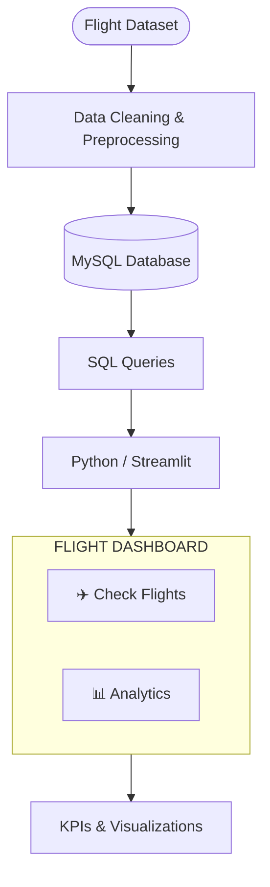
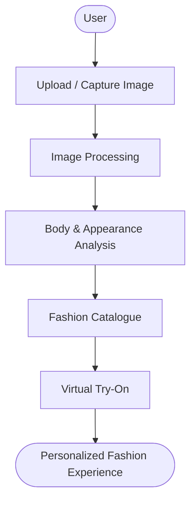

<!-- ===================== HEADER BANNER ===================== -->

  

  

  
  
  

---

## **👋 ABOUT ME**

> **I AM A B.TECH COMPUTER SCIENCE (DATA SCIENCE) STUDENT PASSIONATE ABOUT BUILDING DATA-DRIVEN APPLICATIONS, BACKEND SYSTEMS, AND AI/ML SOLUTIONS.**
>
> **CURRENTLY EXPANDING MY KNOWLEDGE IN AI ENGINEERING, GENERATIVE AI, AND AGENTIC AI.**

<table>
<tr>
<td width="50%" valign="top">

### **🎓 PROFILE**

| | |
|:--|:--|
| **🏫 College** | **PSIT, Kanpur** |
| **📘 Degree** | **B.Tech CSE (Data Science)** |
| **🐍 Core Languages** | **Python, SQL** |
| **⚡ Backend** | **FastAPI** |
| **🗄️ Databases** | **PostgreSQL, MySQL** |
| **🔬 Research** | **AI-Driven Cryptography (Co-Author)** |

</td>
<td width="50%" valign="top">

### **🎯 CURRENT FOCUS**

| | |
|:--|:--|
| **🤖** | **Machine Learning & Deep Learning** |
| **👁️** | **Computer Vision** |
| **✨** | **Generative AI & Agentic AI** |
| **🐳** | **Docker, Git & REST APIs** |
| **☁️** | **Cloud & AI Deployment** |
| **🚀** | **Building Practical Projects** |

</td>
</tr>
</table>

---

## **🛠️ TECH STACK**

<table>
<tr>
<td width="50%" valign="top">

### **👨‍💻 PROGRAMMING LANGUAGES**

  
  
  
  

### **📊 DATA SCIENCE & ML**

  
  
  
  

### **🗄️ DATABASES & SQL**

  
  
  

</td>
<td width="50%" valign="top">

### **⚡ BACKEND & APIs**

  
  
  
  

### **📈 ANALYTICS & VISUALIZATION**

  
  

### **🧰 TOOLS & TECHNOLOGIES**

  
  
  
  
  

</td>
</tr>
</table>

---

## **🚀 FEATURED PROJECTS**

<table>
<tr>
<td width="50%" valign="top">

### **✈️ FLIGHT DASHBOARD & ANALYTICS**

**A DATA ANALYTICS DASHBOARD FOR EXPLORING AND ANALYZING FLIGHT DATA.**

**🧩 TECH STACK**

`PYTHON` `STREAMLIT` `MYSQL` `PANDAS` `SQL` `DATA VISUALIZATION`

**🗺️ CONCEPT FLOW**

</td>
<td width="50%" valign="top">

### **👗 SOIGNÉE – VIRTUAL TRY-ON & FASHION PLATFORM**

**A SMART FASHION-TECH PROJECT COMBINING AI, COMPUTER VISION AND E-COMMERCE FOR A VIRTUAL TRY-ON EXPERIENCE.**

**🧩 TECH STACK**

`PYTHON` `COMPUTER VISION` `AI/ML` `FASTAPI` `SQL`

**🗺️ CONCEPT FLOW**

</td>
</tr>
<tr>
<td width="50%" valign="top">

### **🧠 NLP INSIGHTHUB**

**AN NLP-BASED TEXT ANALYSIS APPLICATION THAT EXTRACTS USEFUL INFORMATION FROM USER-PROVIDED TEXT.**

**🧩 TECH STACK**

`PYTHON` `FLASK` `NLP` `NAMED ENTITY RECOGNITION`

**🎯 FOCUS AREAS**

- **NATURAL LANGUAGE PROCESSING**
- **NAMED ENTITY RECOGNITION**
- **TEXT ANALYSIS**
- **FLASK BACKEND**
- **INTERACTIVE NLP WORKFLOWS**

</td>
<td width="50%" valign="top">

### **🏥 HOSPITAL MORTALITY PREDICTION**

**A DATA ANALYSIS AND VISUALIZATION PROJECT FOCUSED ON UNDERSTANDING FACTORS ASSOCIATED WITH HOSPITAL MORTALITY.**

**🧩 TECH STACK**

`SQL` `MYSQL` `TABLEAU` `DATA ANALYSIS`

 

### **🛒 OLIST E-COMMERCE SQL ANALYSIS**

**A SQL-BASED ANALYSIS OF THE BRAZILIAN OLIST E-COMMERCE DATASET.**

**🧩 TECH STACK**

`MYSQL` `SQL` `DATA ANALYSIS`

**📌 ANALYSIS INCLUDES**

**ORDERS & CUSTOMERS • PRODUCTS & CATEGORIES • SELLERS • ORDER ITEMS • GEOLOCATION • BUSINESS-ORIENTED SQL QUERIES**

</td>
</tr>
</table>

---

## **🔬 RESEARCH**

> ### **🔐 CRYPTOGRAPHY USING ARTIFICIAL INTELLIGENCE**
>
> **RESEARCH WORK EXPLORING THE APPLICATION OF ARTIFICIAL INTELLIGENCE IN CRYPTOGRAPHY.**
>
> **🧪 RESEARCH AREAS:** `ARTIFICIAL INTELLIGENCE` `CRYPTOGRAPHY` `RSA` `AES` `MACHINE LEARNING`
>
> **📄 PUBLISHED PAPER:** **[READ THE RESEARCH PAPER](https://scfa.reapress.com/journal/article/view/59)**

---

## **📚 LEARNING ROADMAP**

```mermaid
flowchart LR
    A[Python] --> B[Advanced SQL<br/>& PostgreSQL]
    B --> C[Data Science]
    C --> D[Machine<br/>Learning]
    D --> E[Deep<br/>Learning]
    E --> F[Computer<br/>Vision]
    F --> G[Generative<br/>AI]
    G --> H[Agentic<br/>AI]
    H --> I[AI<br/>Engineering]

    style A fill:#0e75b6,color:#fff,stroke:#0e75b6
    style B fill:#0e75b6,color:#fff,stroke:#0e75b6
    style C fill:#0e75b6,color:#fff,stroke:#0e75b6
    style D fill:#00a8e8,color:#fff,stroke:#00a8e8
    style E fill:#00a8e8,color:#fff,stroke:#00a8e8
    style F fill:#00a8e8,color:#fff,stroke:#00a8e8
    style G fill:#7b2ff7,color:#fff,stroke:#7b2ff7
    style H fill:#7b2ff7,color:#fff,stroke:#7b2ff7
    style I fill:#7b2ff7,color:#fff,stroke:#7b2ff7
```

### **🎯 WHAT I AM FOCUSING ON NOW**

| **🐍 ADVANCED PYTHON** | **🗄️ POSTGRESQL & ADVANCED SQL** | **📊 DATA ANALYSIS & DATA SCIENCE** |
|:--:|:--:|:--:|
| **🤖 MACHINE LEARNING** | **🧠 DEEP LEARNING** | **👁️ COMPUTER VISION** |
| **✨ GENERATIVE AI** | **🤖 AGENTIC AI** | **⚡ FASTAPI & BACKEND** |
| **🐳 DOCKER** | **☁️ CLOUD & AI DEPLOYMENT** | **🚀 REAL-WORLD PROJECTS** |

---

## **📊 GITHUB STATISTICS**

  
  

  

### **📈 CONTRIBUTION CALENDAR**

  

---

## **🤝 LET'S CONNECT**

  
  
  
  

  <b>☕ I TURN COFFEE INTO CODE AND IDEAS INTO REAL-WORLD PROJECTS.</b>

  

